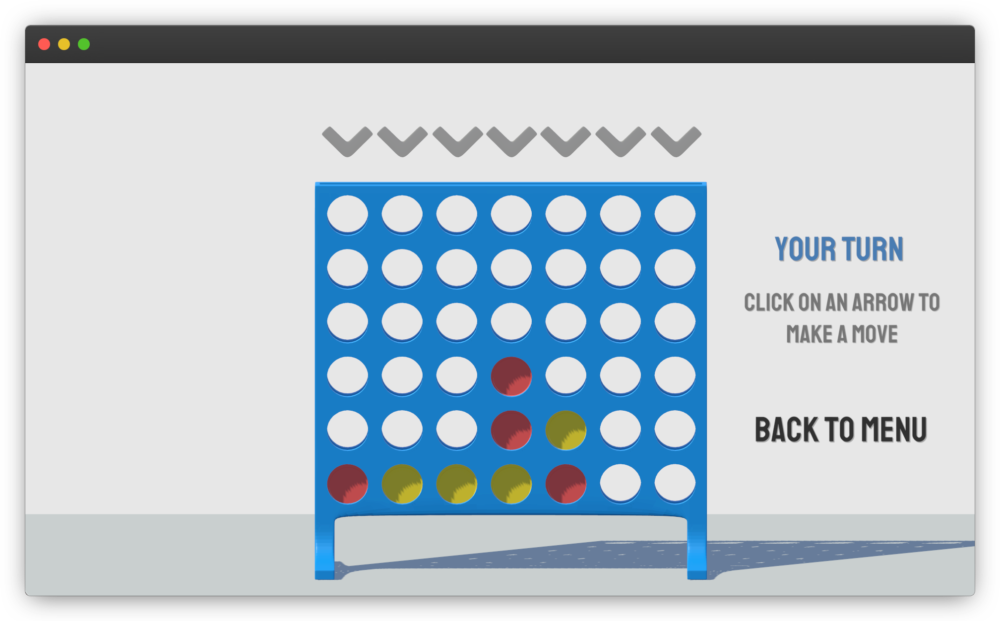

# Connect4
Clone of the game Connect 4 with an AI opponent

Check out release [v1.2](https://github.com/olinjohnson/Connect4/releases/tag/v1.2)

The Connect 4 AI uses Minimax with Alpha-Beta pruning to calculate ideal moves.
It also uses Bitboards for optimized speed and efficiency.

Built with Unity

